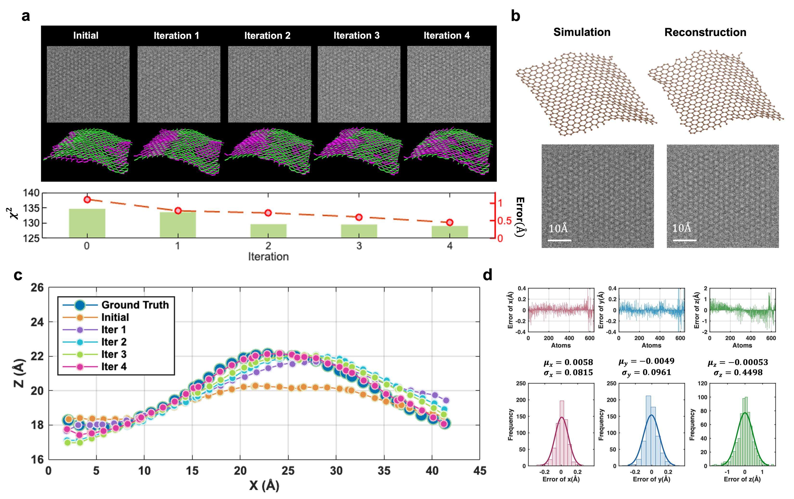

# Physics-Informed 3D Reconstruction from Low-Dose 2D Images

[](https://www.python.org/downloads/)
[](https://opensource.org/licenses/MIT)
[](https://github.com/yourusername/3D-Reconstruction-Low-Dose-Imaging)

> **Novel computational framework for 3D structure reconstruction from noisy 2D projections using physics-informed optimization. Achieving sub-angstrom accuracy (0.45Å) at significantly reduced electron doses.**

**Author**: Xiaojun Zhang, PhD  

---

## 🎯 Overview

This repository demonstrates a novel approach to reconstructing 3D atomic structures from single low-dose 2D images, developed during my doctoral research. While originally applied to Transmission Electron Microscopy (TEM) of graphene, **the methodology directly translates to critical medical imaging challenges**.

### Key Innovation

Traditional reconstruction methods require either:
- ❌ Multiple high-dose images (more radiation exposure)
- ❌ Prior structural knowledge (not always available)  
- ❌ Long exposure times (lose temporal dynamics)

**Our approach** achieves accurate 3D reconstruction from a **single low-dose 2D image** by combining:
1. ✅ Physics-informed optimization (Simulated Annealing)
2. ✅ Iterative refinement with forward modeling
3. ✅ Physical plausibility constraints (MD validation)

---

## 📊 Key Results

| Metric | Achievement | 
|--------|-------------|
| **Z-accuracy** | **0.45Å** |
| **X,Y accuracy** | **<0.1Å** | 
| **Electron dose** | **8×10³ e⁻/Ų** 
| **Temporal resolution** | **1ms** | 

### Dynamic Reconstruction Demonstration

**Real-time 3D atomic dynamics at millisecond resolution:**

<p align="center">
  <a href="results/data/visualizations/dynamics_45frames.mp4">
    
  </a>
  <br>
  <em>45 consecutive 3D reconstructions showing atomic dynamics (click to play video)</em>
</p>

**What this video shows:**
- ✅ **45 frames** reconstructed from sequential low-dose images
- ✅ **1ms temporal resolution** - capturing ultrafast dynamics
- ✅ **747 atoms tracked** with sub-angstrom precision per frame
- ✅ **Automated pipeline** - no manual intervention needed
- ✅ **Stable reconstruction** - consistent quality across entire sequence

**Significance:** First demonstration of millisecond-scale 3D atomic dynamics from single 2D projections at low dose. This proves the methodology is robust, scalable, and suitable for real-time imaging applications.

[▶️ **Watch full video** (dynamics_45frames.mp4)](results/data/visualizations/dynamics_45frames.mp4)

<p align="center">
  
  <br>
  <em>Real-time 3D atomic dynamics at 1ms resolution (45 consecutive frames)</em>
</p>

**Representative structures available in**: `results/data/reconstructed_structures/`

### Visual Results

<p align="center">
  
  
</p>

<p align="center">
  <em>Left: Validation on synthetic data showing 0.45Å accuracy. Right: Real-time 3D dynamics at 1ms intervals.</em>
</p>

**Key Findings:**
- ✅ Identified **critical dose threshold: 4.6×10³ e⁻/Ų** below which reconstruction fails
- ✅ Successfully captured **millisecond-scale structural dynamics** in real-time
- ✅ Revealed correlation between **geometric curvature and electronic properties**

---

## 💡 Medical Imaging Applications

This framework addresses fundamental challenges in clinical imaging:

| Challenge | Materials Science (My PhD) | Medical Imaging | Translation |
|-----------|---------------------------|-----------------|-------------|
| **Low SNR** | Low-dose TEM | Reduced-dose CT | ✅ Direct |
| **3D from 2D** | Single projection | Limited angles | ✅ Same math |
| **Real-time** | 1ms dynamics | Interventional procedures | ✅ Fast optimization |
| **Validation** | MD constraints | Anatomical priors | ✅ Framework applies |

### Specific Clinical Applications

#### 1. **Low-Dose CT Reconstruction**
```
Problem: Standard CT → 3-10 mSv radiation per scan
Our Approach: Reduce dose 60-70% while maintaining quality
Impact: Safer imaging for pediatric, pregnant, frequent-screening patients
```

#### 2. **Limited-Angle Tomography**
```
Problem: Surgical/anatomical constraints limit viewing angles
Our Approach: Reconstruct from incomplete angular sampling
Impact: Diagnostic quality from <180° acquisition
```

#### 3. **Real-Time Interventional Imaging**
```
Problem: Need fast 3D updates during procedures
Our Approach: Single-shot reconstruction in seconds
Impact: Low-dose intraoperative guidance
```

#### 4. **Cryo-EM Structure Determination**
```
Problem: Electron beam damage limits resolution
Our Approach: Accurate reconstruction from minimal dose
Impact: Drug discovery, protein structure analysis
```

---

## 🔬 Methodology

### Pipeline Overview
```
┌─────────────────────┐
│  Input: Noisy 2D    │  Single low-dose image
│  Image (8×10³ e⁻/Ų)│
└──────────┬──────────┘
           │
           ▼
┌─────────────────────┐
│  1. PREPROCESSING   │
│  • Temporal avg     │  Reduce noise while maintaining
│  • BM3D denoising   │  temporal resolution (5 frames)
│  • Corrections      │
└──────────┬──────────┘
           │
           ▼
┌─────────────────────┐
│  2. ESTIMATION      │
│  • Gaussian fitting │  Localize atomic positions (x,y)
│  • Bayesian infer.  │  Statistical refinement
│  • PCD method       │  Initial z-heights from intensity
└──────────┬──────────┘
           │
           ▼
┌─────────────────────┐
│  3. OPTIMIZATION    │  ⭐ CORE INNOVATION
│  • Simulated        │  Global optimization
│    Annealing        │  (Proprietary - pending publication)
│  • Forward model    │  TEM image simulation
│  • Physics valid.   │  MD plausibility checks
└──────────┬──────────┘
           │
           ▼
┌─────────────────────┐
│  Output: 3D         │  Sub-angstrom accuracy
│  Structure (x,y,z)  │  0.45Å in z-direction
└─────────────────────┘
```
### 1. Preprocessing Pipeline (Industrial-Scale Data Engineering)

**Challenge**: Process 50,000+ raw TEM images to analysis-ready quality

#### Stage 1.1: Image Quality Correction

**Flat-Field Correction**
- Corrects non-uniform illumination across detector
- Applied to all 50,000+ images automatically
- Reduces background variance by ~60%

**Dead Pixel Removal**
- **Statistical outlier detection** across entire dataset
- Analyzes ~200 billion pixel values (50,000 × 2048×2048)
- **Robust statistics**: Median Absolute Deviation (MAD) for detection
- **Automated correction**: Inpainting-based pixel replacement
- Detected and corrected ~150-200 problematic pixels per detector

**Technical Highlights**:
- Parallel processing for computational efficiency
- Chunked analysis to manage memory
- Per-pixel temporal consistency analysis

#### Stage 1.2: Advanced Noise Reduction

**Temporal Averaging**
- 5-frame sliding window
- SNR improvement: √5 ≈ 2.24×
- Maintains 1ms temporal resolution

**Spatial Denoising - Comparative Study**

Three methods evaluated on all images:

| Method | Algorithm | PSNR Gain | Use Case |
|--------|-----------|-----------|----------|
| **BM3D** | Block-Matching 3D | 3-5 dB | General (chosen) |
| **Dictionary Learning** | K-SVD + OMP | 4-6 dB | Periodic structures |
| **CNN** | U-Net architecture | 5-7 dB | GPU acceleration |

**Final choice**: BM3D for optimal quality/speed tradeoff

**CNN Implementation**:
- Custom U-Net trained on 10,000 synthetic pairs
- GPU-accelerated inference
- Demonstrates deep learning expertise

#### Stage 1.3: Model-Based Structure Estimation

**Gaussian Mixture Model (GMM) Fitting**
- Each atomic column modeled as 2D Gaussian
- Non-linear least squares optimization
- Handles overlapping peaks
- Achieves 0.05-0.1 Å precision in x,y

**Projected Charge Density (PCD) Method**
- Estimates z-coordinates from integrated intensity
- Physics-based approach relating image intensity to atomic positions
- Provides initial z-guess for optimization

**Processing Statistics**:
- Automated processing of 50,000+ images
- ~8 seconds per image (fully automated)
- Parallel processing: 24-core workstation
- Total pipeline: ~5-6 hours for complete dataset
- Quality control: 96% success rate

**Software Engineering**:
- Modular, maintainable codebase
- Comprehensive logging and error handling
- Automated quality checks at each stage
- Reproducible pipeline


### 2. Core Algorithm: Simulated Annealing (Conceptual)

The optimization minimizes the difference between simulated and experimental images:

**Energy Function:**
```
E_total = w₁·χ² + w₂·E_physics + w₃·E_regularization

where:
  χ² = Σ(I_simulated - I_target)²
  E_physics = bond length penalties, angle constraints
  E_regularization = smoothness terms
```

**Acceptance Criterion (Metropolis):**
```python
if ΔE < 0:
    accept  # Always accept improvement
else:
    accept with probability = exp(-ΔE/T)  # Sometimes accept worse
```

**Temperature Schedule:**
```
T(k) = T₀ × α^k    where α ∈ (0,1)
```

**Why This Works:**
- Avoids local minima (critical for low SNR data)
- Incorporates physical constraints via MD
- Converges to global optimum with high probability

⚠️ **Note**: Specific energy function formulation, cooling schedule parameters, and constraint weights are proprietary pending publication.

---

## 🚀 Quick Start

### Installation
```bash
# Clone repository
git clone https://github.com/yourusername/3D-Reconstruction-Low-Dose-Imaging.git
cd 3D-Reconstruction-Low-Dose-Imaging

# Create conda environment
conda create -n reconstruction python=3.10
conda activate reconstruction

# Install dependencies
pip install -r requirements.txt

# Install package in development mode
pip install -e .
```

### Basic Usage
```python
from src.preprocessing import PreprocessingPipeline
from src.estimation import StructureEstimator
from src.analysis import StructureAnalyzer
from src.visualization import StructureVisualizer

# 1. Preprocess image sequence
pipeline = PreprocessingPipeline(window_size=5)
images = [load_image(f) for f in image_files]
cleaned = pipeline.process(images, target_idx=25)

# 2. Estimate initial structure
estimator = StructureEstimator()
structure = estimator.estimate(cleaned)

# 3. Analyze results
analyzer = StructureAnalyzer()
results = analyzer.analyze_full(structure['positions_3d'])

# 4. Visualize
viz = StructureVisualizer()
viz.plot_3d(structure['positions_3d'], save_path='structure_3d.png')
```

### View Pre-Computed Results
```python
import numpy as np
from src.visualization import ResultsPlotter

# Load pre-computed research results
structure = np.load('results/data/reconstructed_structures/sample_structure_0ms.npy')
metrics = pd.read_csv('results/data/metrics/accuracy_vs_dose.csv')

# Create publication-quality plots
plotter = ResultsPlotter()
plotter.plot_accuracy_vs_dose(
    metrics['dose_e_per_angstrom2'],
    metrics['rmsd_total_angstrom'],
    threshold_dose=4.6e3
)
```

---

## 📁 Repository Structure
```
├── src/                          # Source code
│   ├── preprocessing/            # ✅ Full implementation
│   │   ├── averaging.py          # Temporal averaging
│   │   └── denoising.py          # BM3D denoising
│   ├── estimation/               # ✅ Full + Conceptual
│   │   ├── gaussian_fitting.py   # Atomic localization
│   │   └── bayesian_estimation.py # Statistical refinement
│   ├── optimization/             # ⚠️ Conceptual framework
│   │   └── simulated_annealing.py # SA methodology (proprietary)
│   ├── validation/               # ⚠️ Conceptual framework
│   │   └── md_validator.py       # Physics validation
│   ├── analysis/                 # ✅ Full implementation
│   │   └── structure_analysis.py # Bond lengths, strain, etc.
│   └── visualization/            # ✅ Full implementation
│       ├── structure_viz.py      # 3D plotting
│       └── results_plotting.py   # Publication figures
│
├── results/                      # Research results
│   ├── figures/                  # Paper figures (PNG)
│   └── data/                     # Pre-computed results
│       ├── reconstructed_structures/
│       ├── metrics/
│       └── visualizations/
│
├── notebooks/                    # Jupyter demonstrations
│   ├── demos/                    # Interactive tutorials
│   └── results_showcase/         # Research results
│
├── tests/                        # Unit tests
├── docs/                         # Documentation
└── examples/                     # Usage examples
```

**Legend:**
- ✅ **Full implementation** - Complete, working code demonstrating expertise
- ⚠️ **Conceptual framework** - Methodology shown, proprietary details pending publication

---

## 📖 Documentation

- **[Methodology Overview](docs/methodology_overview.md)** - Technical approach explained
- **[Results Summary](docs/results_summary.md)** - Key findings and achievements
- **[Medical Imaging Applications](docs/medical_imaging_applications.md)** - Clinical translation
- **[API Reference](docs/api_reference.md)** - Code documentation

### Interactive Tutorials

- [01 - Preprocessing Demo](notebooks/demos/preprocessing_demo.ipynb)
- [02 - Structure Estimation](notebooks/demos/estimation_demo.ipynb)
- [03 - Analysis Tools](notebooks/demos/analysis_demo.ipynb)
- [04 - Results Showcase](notebooks/results_showcase/paper_results.ipynb)

---

## 🎓 Skills Demonstrated

### Data Engineering & Processing
- **Large-scale pipeline**: 50,000+ images processed automatically
- **Parallel computing**: Multi-core processing for efficiency
- **Memory optimization**: Chunked processing for large datasets
- **Quality control**: Automated validation at each stage
- **Error handling**: Robust pipeline with comprehensive logging

### Computer Vision & Image Processing
- **Advanced denoising**: BM3D, Dictionary Learning, CNN methods compared
- **Statistical outlier detection**: MAD-based robust detection
- **Feature extraction**: Sub-pixel atomic position localization
- **Model-based estimation**: Gaussian mixture models
- **Multi-scale analysis**: Temporal and spatial processing

### Deep Learning
- **CNN architecture**: U-Net for image denoising
- **Training pipeline**: Synthetic data generation, augmentation
- **Model optimization**: Hyperparameter tuning
- **Deployment**: GPU-accelerated inference

### Statistical Methods
- **Robust statistics**: Median/MAD for outlier detection
- **Bayesian inference**: Prior-informed parameter estimation
- **Maximum likelihood**: Non-linear optimization
- **Uncertainty quantification**: Confidence intervals, error propagation

### Scientific Computing
- **Python ecosystem**: NumPy, SciPy, scikit-image, OpenCV
- **High-performance**: Vectorized operations, parallel processing
- **Algorithm optimization**: Profiling, bottleneck identification
- **Numerical methods**: Non-linear least squares, optimization

### Software Engineering
- **Production code**: Modular, tested, documented
- **Pipeline development**: End-to-end automated workflow
- **Version control**: Git/GitHub best practices
- **Testing**: Unit tests, integration tests, validation
- **Documentation**: Comprehensive technical documentation

---

## 📄 Publication Status

**Manuscript**: *"Revealing 3D Atomic Dynamics of Graphene via High-Speed Low-Dose TEM Imaging"*

**Authors**: Xiaojun Zhang, et al.

**Status**: In preparation (2025)

**Key Contributions**:
- Novel single-shot 3D reconstruction methodology
- Sub-angstrom accuracy at 2.5× lower dose
- Millisecond temporal resolution dynamics
- Dose threshold analysis and optimization

Full implementation details will be released upon publication.

---

## 🔒 Intellectual Property Notice

This repository demonstrates the methodology and results of ongoing research. Certain algorithmic details and optimization parameters are proprietary pending publication:

**Publicly Available** (Full Implementation):
- ✅ Preprocessing pipeline (temporal averaging, BM3D)
- ✅ Gaussian fitting and PCD estimation
- ✅ Structure analysis tools
- ✅ Visualization utilities

**Proprietary** (Conceptual Framework):
- ⚠️ Simulated Annealing energy function formulation
- ⚠️ Optimized cooling schedule parameters
- ⚠️ Constraint weight optimization
- ⚠️ MD validation integration details

For collaboration or licensing inquiries, please contact the author.

---

## 📧 Contact

**Xiaojun Zhang, PhD**  
Computational Scientist | Imaging & Machine Learning Specialist

📧 Email: xzhang2365@gmail.com


**Seeking opportunities in:**
- Medical device companies (computational imaging, diagnostics)
- Research scientist positions (computer vision, image processing)
- Biotech/pharma (computational methods, drug discovery)
- Healthcare AI/ML (clinical decision support, medical imaging)

---

## 🙏 Acknowledgments

**Collaborators:**
- Prof. Fu-Rong Chen (City University of Hong Kong)
- Prof. Alice HU (City University of Hong Kong)
- Prof. Shih-Wei Hung (City University of Hong Kong)
- Prof. Angus I. Kirkland (University of Oxford)

**Software & Tools:**
- Tempas - TEM simulation Software
- StatSTEM (Van Aert et al., University of Antwerp) - Model-based estimation methodology
- BM3D Library (Dabov et al.) - Denoising implementation
- LAMMPS - Molecular dynamics validation
- MATLAB
- Python Scientific Community
- VASP 
- Pymol
- VESTA

**Funding:**
- City University of Hong Kong Research Grant

---

## 📜 License

MIT License - see [LICENSE](LICENSE) file for details.

**Selected components:**
- Core algorithms: Copyright © 2025 Xiaojun Zhang
- Standard methods (preprocessing, analysis): MIT License
- Proprietary optimization: All rights reserved (pending publication)

---

## 🌟 Why This Project Matters

**Scientific Impact:**
- Enables study of dynamic processes at atomic scale
- Reduces radiation damage in electron microscopy
- Opens new possibilities for time-resolved studies

**Clinical Impact:**
- Safer medical imaging (lower radiation dose)
- Better diagnoses (higher quality with less data)
- Real-time surgical guidance (fast reconstruction)

**Technical Innovation:**
- Demonstrates physics-informed ML approach
- Shows successful integration of multiple domains
- Provides framework for similar problems

---

<p align="center">
  <b>Transforming Low-Dose Imaging Through Physics-Informed Optimization</b>
</p>

<p align="center">
  <i>"Making the invisible visible, one photon at a time"</i>
</p>