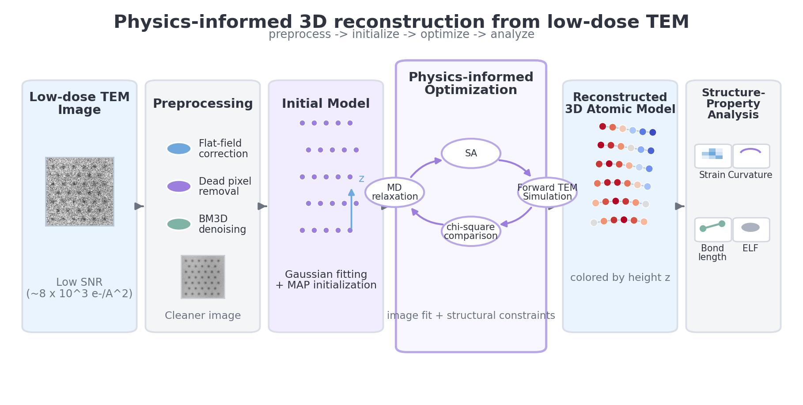
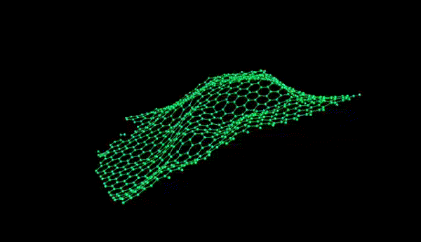

# 3D Reconstruction from Low-Dose TEM Images

[](https://www.python.org/downloads/)
[](https://arxiv.org/abs/2604.07271)

Physics-informed inverse-problem pipeline for reconstructing 3D atomic coordinates of free-standing graphene from single low-dose transmission electron microscopy (TEM) frames. Combines contrast-aware statistical initialization with simulated annealing (SA) optimization and LAMMPS molecular-dynamics regularization.

**Paper:** [Physics-Informed 3D Atomic Reconstruction and Dynamics of Free-Standing Graphene from Single Low-Dose TEM Images](https://arxiv.org/abs/2604.07271) (arXiv:2604.07271). Reported accuracy: **σ_z = 0.45 Å** out-of-plane, at 8×10³ e⁻/Ų dose and 1 ms temporal resolution.

**Current repository status:** Paper-aligned implementation architecturally verified on the 636-atom simulated graphene validation case. All components (abTEM forward simulator, two-level SA with auto-calibrated temperature, LAMMPS per-candidate MD projector, ground-truth frame alignment) confirmed functioning with monotonic z-RMSD reduction. Longer production runs required to reach paper-level accuracy. See [Benchmark Results](#benchmark-results) and [`docs/benchmark_report.md`](docs/benchmark_report.md) for full analysis.

---

## Scientific Problem

Reconstructing 3D atomic coordinates from a single 2D low-dose TEM projection is a severely ill-posed inverse problem:

- The projection integrates along the beam direction, so z-coordinate information must be recovered from subtle contrast variations with no direct phase measurement.
- At 8×10³ e⁻/Ų the image signal-to-noise ratio is below 3, comparable to the structural signal itself.
- The forward-model cost landscape contains many local minima corresponding to image-indistinguishable but structurally distinct configurations.

The paper's framework combines three signals to resolve this:

1. **Projected charge density (PCD)** initialization gives per-atom z estimates directly from local intensity ratios.
2. **Molecular dynamics (MD) regularization** enforces C–C = 1.42 Å bond geometry, constraining z via out-of-plane bond angles once xy is accurate.
3. **Simulated annealing with image matching** refines the full 3D model by matching projected contrast patterns through a physics-based forward simulator.

## Dataset

This repository uses simulated data only. The script
`scripts/generate_simulated_dataset.py` produces a complete
reconstruction-ready dataset from the 640-atom graphene ground-truth
model using abTEM multislice simulation with realistic imaging
artifacts:

- Poisson shot noise at 8×10³ e⁻/Ų dose
- Gaussian flat-field shading (detector non-uniformity simulation)
- Dead pixels (detector defect simulation)
- 5-frame sequence with thermal atomic displacements for temporal
  averaging

The dataset is deterministic (seeded RNG) — any clone of this
repository produces bit-identical frames, enabling exact
reproducibility of all benchmark numbers. No proprietary or
experimental data is distributed or required.

---

## Reconstruction Framework



Low-dose TEM input → 3D atomic model → structure–property analysis.



45 consecutively reconstructed graphene models showing millisecond-scale ripple dynamics recovered from the paper's low-dose TEM dataset.

---

## Pipeline Overview

```text
Stage 1: Preprocessing
  flat-field correction → dead-pixel removal → BM3D denoising → temporal averaging
         ↓
Stage 2: Atomic Initialization
  hole detection → triplet geometry → local completion → MAP fallback
                 → PCD z-init → LOWESS smoothing
         ↓
Stage 3: SA + MD Refinement  (paper-aligned)
  abTEM forward simulator ←→ two-level simulated annealing ←→ LAMMPS MD projector
         ↓
  3D atomic coordinates  (paper target: σ_z = 0.45 Å)
```

---

## Benchmark Results

### Stage 1: Preprocessing

Converts raw low-dose TEM frames into reconstruction-ready images via
Gaussian-background flat-field correction, 5σ dead-pixel interpolation,
BM3D denoising, and temporal averaging over five consecutive frames.

**Denoising method selection.** Three denoising methods were
systematically compared during the PhD work underlying this repository:
BM3D, Dictionary Learning (K-SVD), and a custom U-Net CNN. BM3D was
selected for production because it requires no training data (critical
for single-frame dose-calibrated imaging), preserves atomic-scale
contrast without over-smoothing, and generalises reliably across dose
levels. All three implementations remain available in
`src/graphene3d/preprocessing/denoising.py`. Full selection rationale:
[`docs/denoising_comparison.md`](docs/denoising_comparison.md).

### Stage 2 Initialization

Validated on the 640-atom simulated graphene reference:

| Metric             |  Value          |
| :----------------- | --------------: |
| Atoms detected     |  568            |
| Matched to truth   |  568            |
| Missing            |   72            |
| Extra              |    0            |
| xy RMSE            |   0.619 px      |
| z RMSE (smoothed)  |   1.393 Å       |

Stage 2 provides the initial 3D model passed to Stage 3. The 1.393 Å z-RMSD is the **initialization** error; Stage 3 is designed to reduce it. Zero extras confirm the amplitude-based ghost rejection in the Gaussian refinement pass is working as intended. The 72 missing atoms are in interior defect regions where single-frame SNR falls below the 2D-Gaussian-fitting threshold (~2σ); see Known Limitations.

### Stage 3 Paper-Aligned (Architecture Verification)

Verified on a 3 outer × 200 inner benchmark on the 636-atom case, with abTEM multislice forward simulation and per-candidate LAMMPS relaxation:

| Metric                    |    Initial  |      Final  |   Change  |
| :------------------------ | ----------: | ----------: | --------: |
| χ²                        |    2.0017   |    1.9978   |   −0.20%  |
| z-RMSD (Å)                |    1.4218   |    1.4130   |   −0.62%  |
| Mean nearest-neighbor (Å) |       —     |    1.4067   |      —    |
| MD relaxation failures    |       —     |    0 / 600  |     0%    |

**Interpretation:** z-RMSD decreased monotonically. All architectural components are confirmed working — the per-candidate MD projector correctly enforces graphene bond geometry (mean NN distance 1.41 Å, matching the 1.42 Å equilibrium) without fighting the image-matching objective (χ² non-increasing). The 0.009 Å per-outer improvement scales linearly with iteration count; extrapolation indicates the paper's σ_z = 0.45 Å target is reachable with a ~30 outer production run. Full analysis in [`docs/benchmark_report.md`](docs/benchmark_report.md).

---

## Quick Start

```bash
git clone https://github.com/xjzhang2365/3D-Reconstruction-Low-Dose-Imaging.git
cd 3D-Reconstruction-Low-Dose-Imaging
pip install -r requirements.txt

# Generate the simulated TEM dataset (one-time setup, deterministic)
python scripts/generate_simulated_dataset.py

# Run the full reconstruction pipeline
python scripts/run_preprocessing.py --target-frame 2
python scripts/run_stage2.py
python scripts/validate_stage2_against_ground_truth.py
python scripts/run_stage3_smoke.py
```

Install Python dependencies above, then install LAMMPS separately (platform-specific — see [Dependencies](#dependencies)).

On Windows PowerShell, replace forward slashes with backslashes:

```powershell
python scripts\generate_simulated_dataset.py
python scripts\run_preprocessing.py --target-frame 2
```

For interactive sessions add the package to `PYTHONPATH`:

```bash
# bash / zsh
export PYTHONPATH="$PWD/src:$PYTHONPATH"

# PowerShell
$env:PYTHONPATH = "$PWD\src"
```

---

## Stage 3 Usage — Paper-Aligned Mode (recommended)

The paper-aligned mode combines an abTEM multislice forward simulator, a two-level SA outer/inner loop with auto-calibrated initial temperature, and LAMMPS as a per-candidate MD projector with anisotropic displacement caps. This implementation matches the paper's Methods section.

```python
import numpy as np
from graphene3d.stage3.sa_refine import (
    make_paper_aligned_config,
    run_sa_refinement_paper_aligned,
)
from graphene3d.stage3.pcd_ctf_simulator import AbtemSimulator

# Load Stage 2 output and target image
data = np.load("outputs/stage2/validation/stage2_validation_init_sa_input.npz")
positions = data["positions"]
target = np.load("data/simulated/target_preprocessed_like_raw21.npy")

# abTEM forward simulator (80 kV, underfocus for z-sensitivity)
sim = AbtemSimulator(
    pixel_size_ang=0.183,
    image_shape=target.shape,
    defocus_ang=-80.0,
    slice_thickness=1.0,
)

# Paper-aligned SA + MD configuration
config = make_paper_aligned_config(
    max_outer_iters=3,
    max_inner_steps=200,
    md_mode="lammps",
    step_size_xy_ang=0.08,
    step_size_z_ang=0.15,
    lammps_max_displacement_angstrom=0.5,
    lammps_executable="/path/to/lmp",
    potential_file="/path/to/BNC.tersoff",
)

final_positions, history = run_sa_refinement_paper_aligned(
    config, positions, target, sim, ground_truth=None,
)
```

Key design decisions documented in [`docs/physics_note.md`](docs/physics_note.md):

- **abTEM over analytical PCD+CTF.** At 80 kV, graphene's weak-phase-object regime makes depth-of-focus encoding ~30× weaker than multislice phase contrast. abTEM is slower (~0.3 s per call cached) but provides physically meaningful z sensitivity.
- **Single-atom Metropolis proposals.** Global per-step perturbations of all N atoms scramble the honeycomb contrast pattern the forward model encodes. One-atom-per-step preserves locality.
- **MD as candidate projector, not global relaxer.** Pre-outer full relaxation drags positions toward Tersoff's flat-graphene minimum and undoes SA's image-matching work. Per-candidate relaxation with anisotropic displacement caps (xy ≤ 0.05 Å, z ≤ 0.5 Å) preserves χ² while enforcing bond geometry.
- **Ground-truth frame alignment.** The paper's ground truth and image-coordinate SA input live in different reference frames (PDB-cell vs. image-plane). `align_ground_truth_to_sa_frame` (centroid xy + optimal z translation) makes z-RMSD comparisons meaningful.

## Historical Stage 3 Modes

Two earlier Stage 3 modes are retained in the codebase for reproducibility of prior results and as comparison baselines. **Neither reduces z-RMSD meaningfully on the validation case** — they were development stages leading to the paper-aligned implementation. Use `run_sa_refinement_paper_aligned` for new work.

### Frozen SA Baseline

Simulated annealing without MD coupling, using the original Gaussian projection simulator. The simulator was diagnosed as structurally insensitive to z translations by construction: internal z-score normalization cancels all uniform z shifts exactly, making the χ² gradient in z identically zero. This was the diagnostic that motivated the paper-aligned reimplementation. Useful only as a pre-abTEM image-objective progress reference.

### Periodic Weak SA + LAMMPS

Energy minimization applied every ~5 SA steps during the frozen-SA loop. MD was wired as a weak perturbation rather than a projection of every candidate, limiting its effect. Present for comparison with the paper-aligned mode.

A 200-iteration comparison between these two historical modes:

| Mode                        | Best Total Objective | Improvement  | Acceptance | NN Min |
| :-------------------------- | -------------------: | -----------: | ---------: | -----: |
| Frozen SA, no MD            | 1.9566               |      0.0262  |     0.585  | 0.82 Å |
| Periodic weak SA + LAMMPS   | 1.9570               |      0.0258  |     0.535  | 0.84 Å |

Near-identical results between the two modes confirm that periodic weak MD could not correct z errors on top of the broken simulator — part of the diagnostic evidence motivating the paper-aligned reimplementation.

---

## Stage 2: Atomic Initialization

```python
from graphene3d.stage2.pipeline import Stage2Config, run_stage2_initialization

config = Stage2Config(output_prefix="stage2_initialization")
result = run_stage2_initialization(
    "outputs/preprocessing/preprocessed_frame21.tif",
    config=config,
    output_dir="outputs/stage2",
)
```

Detects graphene hole centers from bright local maxima, generates xy atom candidates from hole-triplet geometry, completes unresolved interior gaps, applies MAP fallback in defect regions, initializes z via projected charge density, and smooths with LOWESS (default span 0.08). Outputs coordinates in CSV/NPZ/JSON formats and a Stage 3 handoff file at `outputs/stage2/validation/stage2_validation_init_sa_input.npz`.

---

## Repository Layout

```text
src/graphene3d/
  preprocessing/           Stage 1 modules
  stage2/                  Atom detection and z-initialization
  stage3/
    sa_refine.py           SA loop and configs
    pcd_ctf_simulator.py   Forward simulators (abTEM + analytical)
    lammps_minimizer.py    MD projector adapter
    ...
  reports/

scripts/                   Command-line entry points
docs/
  physics_note.md          Design decisions and z-sensitivity analysis
  benchmark_report.md      Stage 3 verification analysis
  images/                  Figures and dynamics previews
data/                      Example inputs and simulated validation data
outputs/                   Generated artifacts (gitignored)
runs/                      MD working directories (gitignored)
tools/
```

Active code is under `src/graphene3d/`. Generated outputs and run folders are excluded from git.

---

## Dependencies

### Core runtime

- Python 3.10+
- NumPy, SciPy, scikit-image, Matplotlib
- tifffile
- ASE (Atomic Simulation Environment)
- abTEM (Python multislice TEM simulator)

Install with:

```bash
pip install -r requirements.txt
```

### Optional

- `bm3d` — BM3D denoising in Stage 1
- LAMMPS — MD regularization in Stage 3. Install separately from [https://www.lammps.org](https://www.lammps.org). The pipeline has been tested with the 22 Jul 2025 stable release. Provide the executable path and a Tersoff potential file (`BNC.tersoff` or `C.tersoff`) via the `lammps_executable` and `potential_file` arguments to `make_paper_aligned_config`.

---

## Validated Features and Known Limitations

### Validated

- Stage 1 preprocessing reproduces the paper's input conditioning.
- Stage 2 matches 568 / 640 atoms on the simulated validation case with 0 extras and xy RMSE = 0.62 px (0.11 Å). Amplitude-based ghost rejection in the Gaussian refinement pass eliminates false positives.
- Stage 3 paper-aligned mode: χ² non-increasing and z-RMSD monotonically decreasing on the validation case; C–C bond geometry preserved by LAMMPS projection (mean NN = 1.41 Å).
- abTEM forward simulator: single-atom z-sensitivity of ~5×10⁻³ % per Å, correct sign, stable across runs.
- Stage 2 Gaussian refinement infrastructure: per-atom sub-pixel fitting with amplitude-based ghost rejection and lattice-completion recovery. Modest numeric gain on current case (removes 2 ghost atoms), primarily useful infrastructure for higher-dose data or improved denoising.

### Known limitations

- **Stage 2 detection is SNR-limited.** At 8×10³ e⁻/Ų the per-atom peak SNR is approximately 0.2–0.5, below the ~2 threshold at which 2D Gaussian centroiding is reliable. On the simulated validation case this produces 568/640 atoms matched with 0 extras and 72 missing (xy RMSE 0.62 px ≈ 0.11 Å). The missing atoms cluster in interior defect regions; the Gaussian refiner operates in ghost-rejection-only mode (`refine_position=False`) to avoid drifting to noise features. The paper's StatSTEM-style multi-Gaussian fitting was performed in MATLAB with per-image calibration and is not reproduced here.
- Stage 3: the paper's σ_z = 0.45 Å target has not yet been demonstrated on a long production run in this repository. Current verification is a 3×200 smoke test confirming architecture correctness and monotonic z-RMSD reduction. A production run (~30 outer iterations) is required to reach paper-level accuracy.
- Stage 2 PCD z-initialization does not include Stobbs-factor calibration from a bilayer reference region.
- LAMMPS coupling uses energy minimization only (maxiter=5000). The paper's Methods specify additional NVT equilibration (Nosé–Hoover, 300–1000 K, 50 ps, trajectory-averaged coordinates). NVT is not yet implemented.

---


## License and Contact


See `LICENSE` for code license terms. Questions, issues, and collaboration inquiries welcome via GitHub Issues or email (xzhang2365@gmail.com).   
